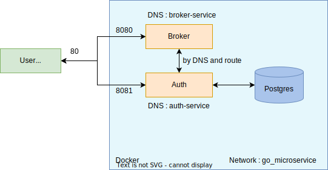

# Working-with-Microservices-in-Golang

</br>

### Installed Packages
```
go get github.com/go-chi/chi/v5
go get github.com/go-chi/chi/v5/middleware
go get github.com/go-chi/chi/cors

```
</br>

### Architecture
