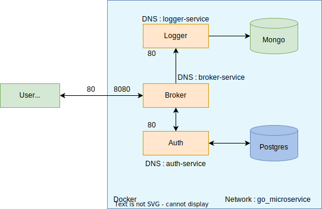

# Working-with-Microservices-in-Golang

</br>

### Installed Packages
```
go get github.com/go-chi/chi/v5
go get github.com/go-chi/chi/v5/middleware
go get github.com/go-chi/cors
go get golang.org/x/crypto/bcrypt
go get github.com/jackc/pgconn
go get github.com/jackc/pgx/v4/stdlib
go get go.mongodb.org/mongo-driver/mongo
```
</br>

### Architecture
